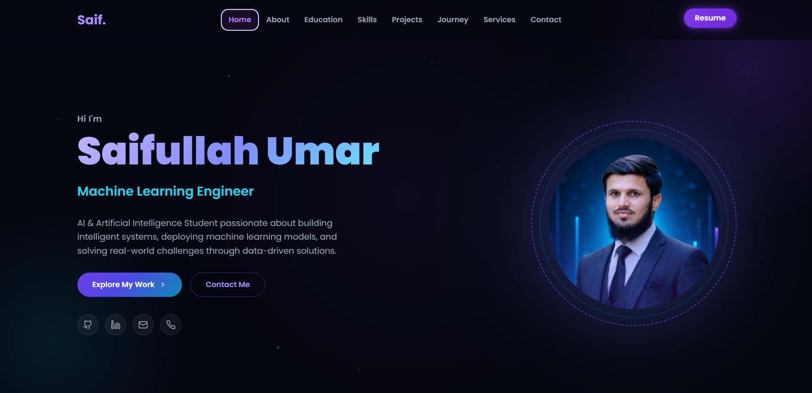

# 🌟 Saifullah Umar | AI & Machine Learning Portfolio

<div align="center">



### 🚀 Modern Portfolio Website

A modern, responsive, and interactive portfolio showcasing my skills, projects, education, and journey as an **Artificial Intelligence student** and **Machine Learning Engineer**.

[](https://vitejs.dev/)
[]()
[]()
[]()

</div>

---

# 📖 About

This portfolio represents my journey as a **BS Artificial Intelligence** student and aspiring **Machine Learning Engineer**. It highlights my technical skills, educational background, projects, and services through a modern and visually appealing interface.

The website is designed with smooth animations, responsive layouts, glowing UI elements, and an elegant dark theme to create a professional user experience.

---

# ✨ Features

- 🎨 Modern Dark UI Design
- 📱 Fully Responsive Layout
- ⚡ Lightning Fast with Vite
- 🌌 Animated Hero Section
- 👨‍💻 About Me Section
- 🎓 Education Timeline
- 💡 Skills Showcase
- 📂 Projects Portfolio
- 🚀 Professional Journey
- 🛠 Services Section
- 📧 Contact Form
- 📄 Resume Download
- 🔗 Social Media Links
- ✨ Smooth Scrolling & Animations

---

# 🖼 Website Sections

## 🏠 Home

The landing page introduces me with a modern hero section featuring animated typography, profile image, call-to-action buttons, and social media links.

---

## 👨‍💻 About

Provides a brief introduction about myself, my interests, career goals, and passion for Artificial Intelligence and Machine Learning.

---

## 🎓 Education

Displays my academic background and achievements.

---

## 💻 Skills

### 🤖 Machine Learning & AI
- Machine Learning
- Model Training
- Model Evaluation
- Hyperparameter Optimization
- Model Deployment
- RAG-based Chatbots

### 👨‍💻 Programming & Development
- Python
- Scikit-learn
- Frontend Development
- Data Preprocessing
- Feature Engineering
- Statistical Analysis

---

## 📂 Projects

A collection of my featured projects with descriptions, technologies used, and project highlights.

---

## 🚀 Journey

Illustrates my learning path, certifications, internships, and professional growth.

---

## 🛠 Services

Showcases the services I provide, including:

- Web Development
- Machine Learning Solutions
- AI Projects
- Portfolio Development

---

## 📞 Contact

Allows visitors to contact me through the contact form or social media platforms.

---

# ⚙️ Technologies Used

| Frontend | Tools |
|-----------|------|
| HTML5 | Git |
| CSS3 | GitHub |
| JavaScript (ES6) | VS Code |
| Vite | npm |
| EmailJS | |

---

# 📁 Project Structure

```
my_portfolio/
│
├── src/
│   ├── components/
│   ├── pages/
│   ├── styles/
│   └── assets/
│
├── attached_assets/
├── guidelines/
├── index.html
├── package.json
├── vite.config.ts
└── README.md
```

---

# ⚡ Installation

Clone the repository

```bash
git clone https://github.com/SaifUllahUmar0317/my_portfolio.git
```

Go to project folder

```bash
cd my_portfolio
```

Install dependencies

```bash
npm install
```

Run development server

```bash
npm run dev
```

Open your browser

```
http://localhost:5173
```

---

# 🏗 Build for Production

```bash
npm run build
```

Preview production build

```bash
npm run preview
```

---

# 🔄 How It Works

### 1️⃣ Landing Page

Visitors are welcomed with a modern hero section introducing me as an AI and Machine Learning enthusiast.

↓

### 2️⃣ Navigation

The navigation bar allows users to smoothly move between:

- Home
- About
- Education
- Skills
- Projects
- Journey
- Services
- Contact

↓

### 3️⃣ Learn About Me

Visitors can explore my educational background, technical skills, and career objectives.

↓

### 4️⃣ Explore Projects

Users can browse my featured projects and discover the technologies used in each.

↓

### 5️⃣ Contact Me

Interested clients, recruiters, or collaborators can easily connect with me using the contact section or social media links.

---

# 📷 Website Preview

## Home Page


---

# 👨‍💻 Author

## Saifullah Umar

**BS Artificial Intelligence Student**

Aspiring **Machine Learning Engineer**

### 📬 Connect With Me

- GitHub: https://github.com/SaifUllahUmar0317
- Email: saifullahumar.ai@gmail.com
- LinkedIn: https://www.linkedin.com/in/saifullah-umar-624115409/

---

# ⭐ Show Your Support

If you like this project, please consider giving it a ⭐ on GitHub.

It motivates me to build more open-source projects.

---

# 📜 License

This project is licensed under the MIT License.